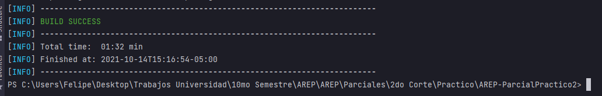
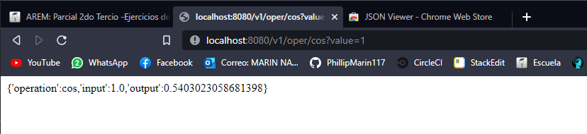
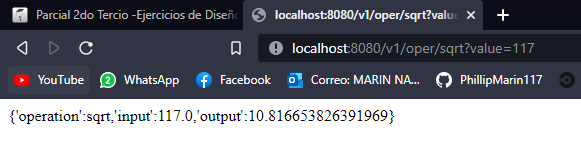
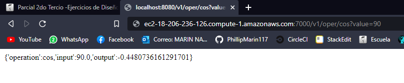
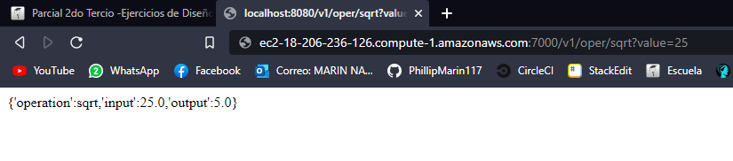

# AREP-ParcialPractico2

Fecha: Miércoles, /1 de Octubre del 2021

Segundo Parcial de Arquitecturas Empresariales (AREP).

Diseñe un prototipo de calculadora de microservicios que tenga un servicios de matemáticas con al menos dos funciones implementadas y desplegadas en al menos dos instancias virtuales de EC2. Además debe implementar un service proxy que recibe las solicitudes de servicios y se las delega a las dos instancias usando un algoritmo de round-robin. Asegúrese que se pueden configurar las direcciones y puertos de las instancias en el porxy usando variables de entorno del sistema operativo. Cada estudiante debe seleccionar para desarrollar dos funciones matemáticas de acuerdo a los dos últimos dígitos de su cédula como se especifica en la lista (Si sus dos últimos dígitos de su cédula son el mismo use el siguiente dígito que sea diferente). Todas las funciones reciben un solo parámetro de tipo "Double" y retornan una parámetro de tipo "Double".

0. log

1. ln

2. sin

3. cos

4. tan

5. acos

6. asin

7. atan

8. sqrt

9. exp (el número de eauler elevado ala potendia del parámetro)

Implemente los servicios para responder al método de solicitud HTTP GET. Deben usar el nombre de la función especificado en la lista y el parámetro debe ser pasado en la variable de query con nombre "value".

  

El proxy debe delegar el llamado a los servicios de backend. El proxy y los servicios se deben implementar en Java usando Spark.  

  

  

Ejemplo de una llamado:

  

EC2

[https://amazonxxx.x.xxx.x.xxx:{port}/cos?value=3.141592](https://amazonxxx.x.xxx.x.xxx:{port}/cos?value=3.141592)

  

Salida. El formato de la salida y la respuesta debe ser un JSON con el siguiente formato

  

{

  

"operation": "cos",

  

"input": 3.141592,

  

"output": -0.999999

  

}

## Contenido

  - [Prerrequisitos](#prerrequisitos)
  - [Ejecutar De Forma Local](#ejecutar-de-forma-local)
  - [Ejecutar Desde Imagen de Docker](#ejecutar-desde-Imagen-de-docker)
  - [Uso](#uso)
  - [Demo](#demo)
  - [Diagramas](#diagramas)
  - [Generación de Javadoc](#generación-de-javadoc)
  - [Autor](#autor)
  - [Licencia](#licencia)

## Prerrequisitos

Para el desarrollo del proyecto se utilizó **Maven** como una herramienta para la construcción y gestión del mismo, el código fue desarrollado con el lenguaje de programación **Java**; por lo tanto se requiere para su ejecución tener estas dos herramientas en las versiones especificadas a continuación.

  - Java versión 8 o superior
  
  - Maven versión 3.5 o superior.

## Ejecutar De Forma Local

  1. Clonar el proyecto con el comando `git clone https://github.com/PhillipMarin117/AREP-ParcialPractico2.git`.
  2. Compila el proyecto con el comando `mvn package`, debería obtener despues de un minuto un resultado similar a lo siguiente:

     
     
  3. Ejecutar la aplicacion con el comando java:
      
      **Windows** `java -cp target/classes;target/dependency/* edu.ecuelaing.arep.calculator`
      
 
  4. Dirigirte a la dirección `http://localhost:8080` en tu Web Browser.
	
	
	
	

## Ejecutar Desde Imagen de Docker
   Útil para las instancias EC2 de Amazon.
   
   1. Instalar y Configurar Docker.

      Instalación en Amazon EC2: `sudo yum update -y && sudo yum install docker`.
      
      Inicio de Servicio: `sudo service docker start`.
      
      Configuración de usuario: `sudo usermod -a -G docker <usuario>` , el usuario es por defecto ec2-user.
      
      **Para estar seguro de guardar los cambios, salir y volver a entrar a la instancia**

   2. Descargar la imagen pública de DockerHub con el comando `docker pull PhillipMarin117/ArepParcia12`
   3. Crear una instancia basada en la imagen con el comando `docker run -d -p <puerto>:7000 --name <nombre> PhillipMarin117/ArepParcia12` donde el nombre y el puerto son los que tu quieras.
   4. Para acceder a los logs usar el comando `docker logs -f <nombre>`.
   5. Para ver la aplicación debes dirigirte a la dirección `http://<nombre de tu instancia EC2>.amazonaws.com:<puerto>/`

## Uso

  
  1. Usando el endpoint `cos` con el parámetro value obtendrás lo siguiente:

     

  2. Usando el endpoint `sqrt` con el parámetro value obtendrás lo siguiente:

     
     

## Diagramas

### Diagrama de Clases

La aplicación convierte los objetos a JSON por medio del objeto Gson de Google, y calcula el coseno y la raíz por medio de la interfaz **Services**, su implementación recibe el número y retorna un objeto de tipo AppResponse; este objeto alberga el nombre de la operación, el valor de entrada y el resultado de la misma.

## Autor

  - **[Felipe Marín](https://github.com/PhillipMarin117)**
F
## Licencia

Este proyecto está licenciado bajo la licencia **General Public License v3.0**, revise el archivo [LICENSE](LICENSE) para más detalles.
